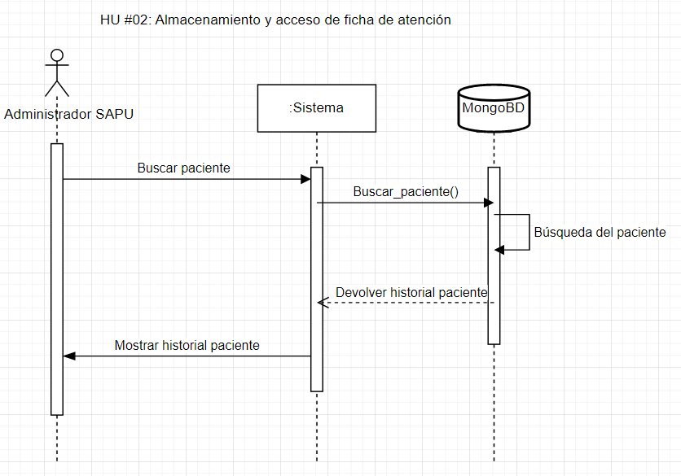

Como ya las fichas de atención se encuentran almacenadas, lo siguiente sería dar la opción de acceder a fichas de atención pasadas.

(**NOTA**): si no se encuentra el paciente, solo mostrará de que no tiene fichas de atención creadas, y no se considera un error, esto es de momento en esta etapa de desarrollo, más adelante quizá se pueda considerar error o no. 